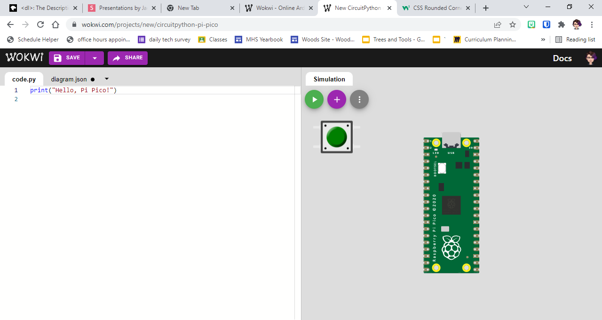

# Exercise 9 - Conditional Statements

## Goals
- Write and modify conditional statements
- Use conditional statements to create branching logic

## Preparation
- You may work with the circuit simulator or a physical circuit
- Go to [Wokwi](https://wokwi.com/) and create a new CircuitPython project by clicking the <button style="color:white;background-color:purple;padding:.5em;border-radius:.5em;">+ More Options</button> button, then choosing `CircuitPython on Raspberry Pi Pico`
- Find the <button style="color:white;background-color:purple;padding:.5em;border-radius:50%"> + </button> button and add a pushbutton to your circuit. It should like something like the circuit below



## Concepts & Vocabulary
- Conditional statement
- `if`
- `elif`
- `else`
- logical test/test condition

## Explanation - Conditional Statements

A conditional statement allows your code to make decisions.

### If statement

An if statement is the simplest version of a conditional statement:

    *if* the test condition is true, *then* do something

In code:

```python
print("This happens before both the loop and the conditional statement")
# loop through every number from 0 - 9
for n in range(10):
  # print the number. This is outside the conditional statement, so it happens every time
  print(n)
  # if the number is less than 5, also print "That's a small number!"
  if n < 5:
    print("That's a small number!")

print("We've exited the loop")
```

### Limitations of the if statement

An `if` statement will run if a condition is true. If that condition is not true, nothing happens. But sometimes, that's not what you want. For instance, imagine if you were deciding what to eat for lunch.

    *if* there is pizza available, *then* eat the pizza

In this example, you probably still want to eat something for lunch. Alternatively, you might look at this as: 

    *if* the button is pushed, *then* turn on the LED

The problem there is that if there isn't pizza, you just don't eat anything. If the button isn't pushed, the LED still stays on once you've turned it on. Sometimes, you can fix this by creating `if` statements for every possible condition.

    *if* the button is pushed, *then* turn on the LED
    *if* the button isn't pushed, *then* turn of the LED

This works pretty well if you have a well defined set of possibilities like the button, which can only be in one of two states. There's a couple of problems with this option, though:

1. We have to check every if statement, which slows down the code
2. We have to identify every possibility, which isn't always an option (do you really want to list out *every* food you might eat for lunch?)
3. Sometimes it might be important to stop checking after you find a true option. Consider the following example:

```python
student_score = 68

if student_score >= 90:
  print("you earned an A")
if student_score >= 80:
  print("you earned a B")
if student_score >= 70:
  print("you earned a C")
if student_score >= 65:
  print("you earned a D")
if student_score < 65:
  print("you failed :( ")
```

What will print if student_score is 68 as shown above? What if you change it to 75? How about 85? Or 95? If you're not sure, try running the code! It won't do anything to your LED, but it will run just fine and will print to the serial monitor. We'll come back to this example in a little while.

### Else Statement

You can chain `if` and `else` together to create a more advanced conditional statement.

    *if* the condition is true, *then* do something
    *otherwise* do something else

    *if* there is pizza available, eat a slice of pizza
    *otherwise* eat the tastiest available lunch

    *if* the button is pushed, *then* turn on the LED
    *otherwise* turn off the LED

The way this works is that if the conditional test for the `if` statement is true, the indented code under `if` will run, and the computer will skip `else`. If the test isn't true, the `if` statement is skipped and the indented code under `else` will run. If you want to see this in action, make sure you've got a button set up correctly and try the code below:

```python

# skipped setup code for brevity
################################
if button.value:
  print("the button is returning True")
else:
  print("the button is not returning True")
```

## Elif Statement

So now you can do `if` and `else`, but what if you have more than one thing to check for, like the grades example above? That's where the `elif` statement comes in.

You'll always have exactly one `if` statement in a chain. You can have at most one `else`. But you can have as many or as few `elif` statements as you want. An elif statement is an `if` statement that will only be checked if the statement before it in the chain doesn't run. For example, we can fix the grades example using `elif` and `else`:

```python
student_score = 68

if student_score >= 90:
  print("you earned an A")
elif student_score >= 80:
  print("you earned a B")
elif student_score >= 70:
  print("you earned a C")
elif student_score >= 65:
  print("you earned a D")
else:
  print("you failed :( ")
```

In this version, as soon as one of those statements is True, we'll print out what score the student earned, and then exit. If none were true, the student failed so that's the message we print.

## Try It

Based on what we covered in class and what's reviewed in this document, demonstrate that you can use a button and a conditional statement to control an LED

## Show me your code in action

- 5 points: You successfully control an LED with a button using both `if` and `else`. This should be based on programming, not directly hooking the LED up to the button
- 4 points: You can successfully control the LED using at least an `if` statement
- 3 points: You can do *something* with a conditional statement
- Anything less will not be considered successful completion

--8<-- "includes/glossary.md"