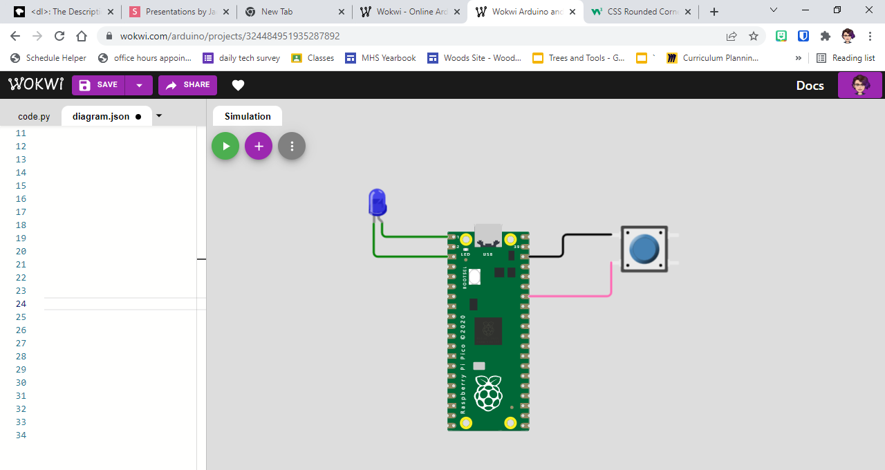

# Exercise 10 - More Conditional Statements

## Goals
- Write and modify conditional statements
- Use conditional statements to create branching logic

## Preparation
- You may work with the circuit simulator or a physical circuit
- Go to [Wokwi](https://wokwi.com/) and create a new CircuitPython project by clicking the <button style="color:white;background-color:purple;padding:.5em;border-radius:.5em;">+ More Options</button> button, then choosing `CircuitPython on Raspberry Pi Pico`
- Find the <button style="color:white;background-color:purple;padding:.5em;border-radius:50%"> + </button> button and add a pushbutton to your circuit. It should like something like the circuit below



## Concepts & Vocabulary
- Conditional statement
- `if`
- `elif`
- `else`
- logical test/test condition

## Review - Conditional Statements

### If

An `if` statement can be used on its own.

**if** the condition is true, **then** do something

**if** the class is being particularly good, **then** give each student a brownie

**if** you are cold, **then** put on a jacket

**if** the button is pressed, **then** turn on the LED

The `if` statement will do something if the test is true, but will be skipped without any effect if the test is not true

### If/Else

An `else` can be used in combination with an `if`, but never on its own. You can never have more than one `else` to go with an `if`

---
**if** the condition is true, **then** do something

**otherwise**, do something else

---
**if** the class is being particularly good, **then** give each student a brownie

**otherwise**, start today's lesson

---
**if** you are cold, **then** put on a jacket

**otherwise**, go swimming

---
**if** the button is pressed, **then** turn on the LED

**otherwise**, turn off the LED

---

### If/Elif/Else

The `if`/`else` combo above is great if you're checking for something that only has two possible outcomes, either because what you're testing (for instance whether a pushbutton is pressed down) only has two possibilities, or because you're going to have some sort of default, where you do something specific in one circiumstance, and a more generic response in some other circumstance. Sometimes, you need more than two possible outcomes, though, so that's where `elif` (short for `else if`) comes in. Look at the following example:

---
**if** you are cold, **then** put on a jacket

**otherwise**, go swimming

---

I'm sure you can imagine plenty of possibilities where you wouldn't need to put on a jacket, but also wouldn't want to go swimming. We can rewrite this to be a little more reasonable:

---
**if** you are cold, **then** put on a jacket

**otherwise if** you are overheated, **then** put on a swimsuit and go swimming

**otherwise** relax and hang out with your friends

---

### In code:

```python
n = random.random()

if n < .5:
  print("small!")
elif n == .5:
  print("right in the middle!")
else:
  print("large!")
```

## Try It

Use one or more buttons to configure settings in your code, rather than directly controlling the button


Examples:

- Challenging: Use a Neopixel and have a list of colors. Each time you push the button, you cycle through the colors for the Neopixel
- Challenging: Use two buttons to increase or decrease the blink rate of the LED
- Moderate: Use a button to determine whether or not the LED blinks
- Easy: While a button is pressed, increase the blink rate of the LED

## Show me your code in action

- 5 points: successful completion of a challenging example
- less than 5 points: successful completion of a less challenging example

--8<-- "includes/glossary.md"