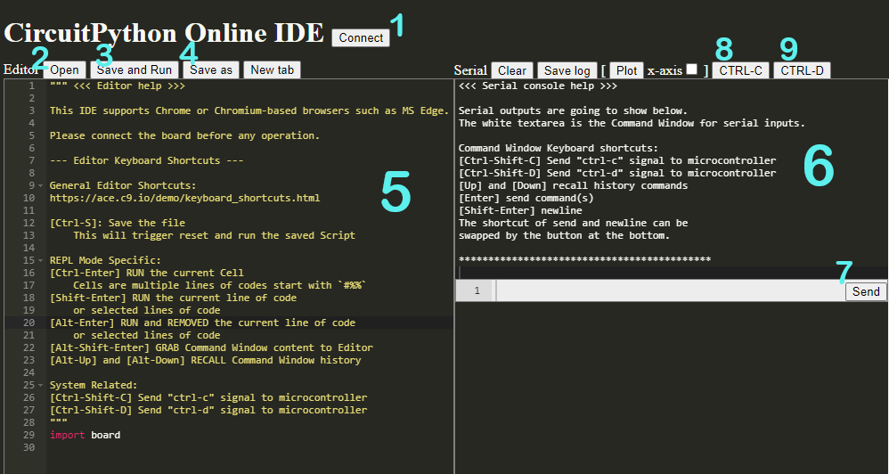

# Development Environment

The IDE is the program in which you will write your code. An IDE is an all-in-one program that lets you write and run code, often with many other features included. For working with microcontrollers, an IDE should have a serial console. You don't technically need an IDE - you can write your code in any text editor (like Notepad on Windows) and run your code separately, but an IDE is a lot more convenient.

For work in this class, we'll be using the [CircuitPython Online IDE](https://urfdvw.github.io/CircuitPython-online-IDE/) because it works on Chromebooks.

## CircuitPython Online IDE Interface

`1 - Connect`
:   This button will let you connect the board to the IDE so you can interact with it from your computer. When connected, it will show `connected` instead of `connect`, but watch out - if the board gets disconnected accidentally, the online IDE doesn't know so it'll still say `connected` and you'll need to reload the page

`2 - Open`
:   This button will let you open files from your board. If you don't see your files, make sure you're looking in the right folder!

`3 - Save and Run`
:   This button will save your code and reboot the board so the code runs

`4 - Save As`
:   This will let you save a copy of the file you're currently editing. Don't forget to save your work to your computer. There's no guarantee it will still be on the board when you get it back!

`5 - Editor Window`
:   This is the window where you'll edit your code

`6 - Serial Console`
:   This window contains the serial console so you can interact with the board

`7 - Command Window`
:   This is where you'll type inputs for the serial console

`8 - Force Stop`
:   This button will use the serial console's ++ctrl++ + ++c++ shortcut to force stop whatever's running. You can also do this from the keyboard, but watch out for the change to the shortcut. In the online IDE, you'll need to use ++ctrl++ + ++shift++ + ++c++ and may still run into issues because it may bring up the browser's developer tools

`9 - Reboot`
:   This button will use the serial console's ++ctrl++ + ++d++ shortcut to reboot the board. You can also do this from the keyboard, but watch out for the change to the shortcut. In the online IDE, you'll need to use ++ctrl++ + ++shift++ + ++d++ or you'll end up bookmarking the website instead

--8<-- "includes/glossary.md"